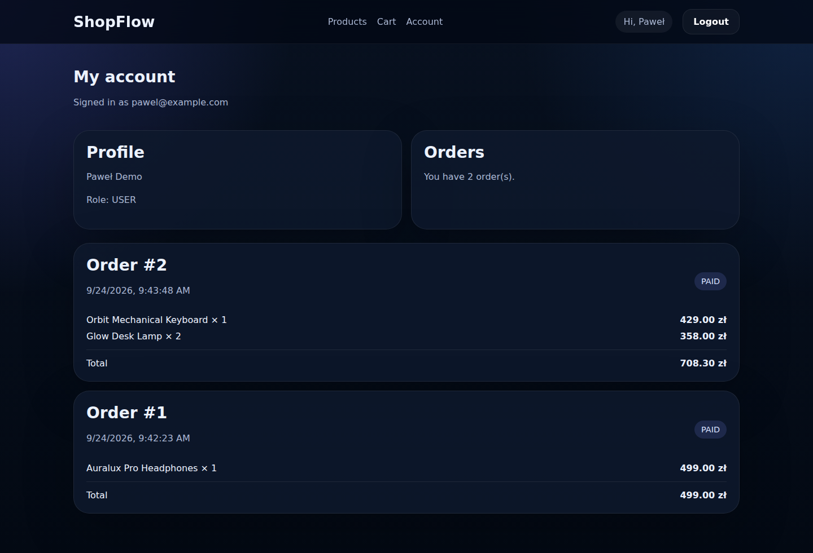
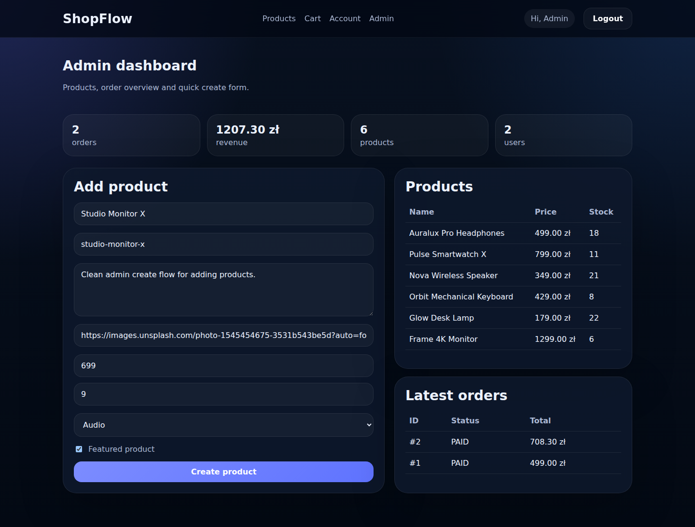

# ShopFlow

Pełny sklep internetowy full stack, który uruchamia się lokalnie **bez Dockera
i bez zewnętrznej bazy** — Prisma na SQLite.


## Stack

| Warstwa | Technologia |
|---|---|
| Frontend | React 18, TypeScript, Vite |
| Backend | Express, TypeScript |
| Baza | Prisma ORM + SQLite |
| Uwierzytelnianie | JWT (`jsonwebtoken`) + bcrypt |
| Walidacja | Zod na granicy API |
| Testy | Vitest + supertest — 32 testy endpointów |

## Co jest w środku

- rejestracja i logowanie (hasła hashowane bcryptem)
- role `USER` / `ADMIN` z osobnym middleware `adminOnly`
- katalog produktów, wyszukiwarka, filtrowanie i sortowanie
- karta produktu, koszyk w `localStorage`
- checkout: walidacja stanów magazynowych, kupony procentowe i kwotowe
  z progiem minimalnej wartości, zamówienie z pozycjami w transakcji
- historia zamówień użytkownika
- panel administratora: statystyki, lista produktów, dodawanie, lista zamówień
- seed z kategoriami, produktami, administratorem i kuponem

### Model danych

Sześć encji w [`server/prisma/schema.prisma`](server/prisma/schema.prisma):
`User`, `Category`, `Product`, `Coupon`, `Order`, `OrderItem` — z enumami
`Role` i `CouponType`, relacjami i unikalnymi slugami.

## Zrzuty ekranu

Zrzuty z działającej lokalnie aplikacji (dane z `npm run seed` plus jedno
zamówienie złożone przez API z kuponem `WELCOME10`).

**Historia zamówień klienta:** pozycje, ceny i suma po rabacie (787 zł − 10% = 708,30 zł).



**Panel administratora:** statystyki, formularz dodawania produktu, stany
magazynowe i ostatnie zamówienia. Stany Orbit Keyboard (9 → 8) i Glow Desk
Lamp (24 → 22) są już po checkoutcie: zamówienie zdejmuje towar z magazynu
w tej samej transakcji.



> Widoków z grafiką produktów (strona główna, katalog, karta produktu, koszyk)
> tu nie ma. Zdjęcia ładują się z `images.unsplash.com`, a środowisko, w którym
> robiono zrzuty, blokowało ten host. Zamiast wstawiać podmienione obrazki,
> pomijam te widoki.

## Uruchomienie

Wymagany Node 20+. Polecenia są takie same na Linuksie, macOS i Windows
(PowerShell) — jedyną różnicą jest sposób kopiowania pliku `.env`.

### 1. Backend

```bash
cd server
cp .env.example .env          # Windows PowerShell: copy .env.example .env
```

Otwórz `server/.env` i ustaw `JWT_SECRET`. **Serwer odmówi startu bez niego** —
nie ma wartości domyślnej, bo sekret zapisany w kodzie jest publiczny razem
z repozytorium. Wygeneruj własny:

```bash
node -e "console.log(require('crypto').randomBytes(48).toString('base64url'))"
```

Następnie:

```bash
npm install
npx prisma generate
npx prisma db push
npm run seed
npm run dev
```

Backend wystartuje na `http://localhost:3000`.

### 2. Frontend

W drugim terminalu:

```bash
cd client
cp .env.example .env          # Windows PowerShell: copy .env.example .env
npm install
npm run dev
```

Frontend wystartuje na `http://localhost:5173`.

## Dane testowe

Tworzone przez `npm run seed`:

| Co | Wartość |
|---|---|
| Administrator | `admin@shopflow.com` / `Admin123!` |
| Kupon | `WELCOME10` |

> Konto administratora jest celowo znane — to dane demonstracyjne w bazie
> SQLite tworzonej lokalnie, nie poświadczenia do czegokolwiek wystawionego na
> zewnątrz. Sekret podpisujący tokeny (`JWT_SECRET`) to osobna sprawa i **nie
> jest** w repozytorium.

## API

| Metoda | Ścieżka | Dostęp |
|---|---|---|
| `GET` | `/api/health` | publiczny |
| `POST` | `/api/auth/register` | publiczny |
| `POST` | `/api/auth/login` | publiczny |
| `GET` | `/api/auth/me` | zalogowany |
| `GET` | `/api/categories` | publiczny |
| `GET` | `/api/products` | publiczny (filtry w query) |
| `GET` | `/api/products/:slug` | publiczny |
| `GET` | `/api/coupons/:code` | publiczny |
| `POST` | `/api/orders` | zalogowany |
| `GET` | `/api/orders/my` | zalogowany |
| `GET` | `/api/admin/stats` | **admin** |
| `GET` | `/api/admin/products` | **admin** |
| `POST` | `/api/admin/products` | **admin** |
| `GET` | `/api/admin/orders` | **admin** |

## Testy

```bash
cd server
npm test
```

32 testy przez supertest, na osobnej bazie SQLite w katalogu tymczasowym —
nie dotykają `dev.db`. Pokrywają rejestrację i logowanie, odrzucanie
podrobionych tokenów, **granicę roli administratora** (zalogowany ≠ uprawniony),
walidację stanów magazynowych, naliczanie kuponu i izolację historii zamówień
między użytkownikami.

## Zależności i bezpieczeństwo

`npm audit` zwraca **0 podatności** w obu pakietach. Żeby to osiągnąć, w
`server/package.json` jest blok `overrides`:

| Paczka | Wymuszona wersja | Dlaczego |
|---|---|---|
| `effect` | `^3.20.0` | zależność CLI Prismy; GHSA-38f7-945m-qr2g |
| `deepmerge-ts` | `^8.0.0` | zależność CLI Prismy; GHSA-ggr8-5vv4-36mx |
| `qs` | `^6.16.0` | Express 4 przypina `~6.14.0`; GHSA-4mjr-xmp4-gh2g |
| `esbuild` | `^0.28.1` | `tsx` przypina `~0.27.0`; GHSA-g7r4-m6w7-qqqr |

Te nadpisania podnoszą paczki **ponad zakresy deklarowane przez ich
rodziców** — czyli robią coś, czego npm sam nie zrobi. Dlatego nie zostały
przyjęte na słowo: po każdym z nich sprawdzone zostały `prisma generate`,
`prisma db push`, seed przez `tsx`, kompilacja TypeScriptu i pełny zestaw
32 testów. Wszystko przechodzi.

Naturalne rozwiązanie docelowe to Prisma 8 i Express 5, które nie potrzebują
już tych nadpisań. Prisma 8 jest na dzień pisania dopiero w wersji
`8.0.0-rc`, a przejście na Express 5 to zmiana łamiąca — oba są do zrobienia
świadomie, a nie przy okazji `npm audit fix`.

CI blokuje merge przy podatności o poziomie `high` lub wyższym.

## Znane ograniczenia

- **Brak bramki płatniczej.** Checkout tworzy zamówienie, ale niczego nie
  pobiera — to demo logiki sklepu, nie integracja z operatorem płatności.
- **SQLite.** Wystarcza lokalnie; przepięcie na PostgreSQL to zmiana
  `provider` w `schema.prisma` i `DATABASE_URL`.
- **Token w `localStorage`** po stronie klienta — wygodne, ale podatne na XSS.
  Docelowo ciasteczko `httpOnly`.

## Licencja

MIT — patrz [LICENSE](LICENSE).
